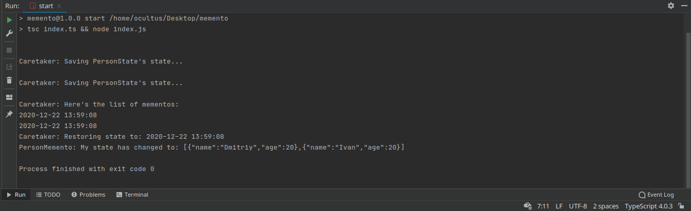

# University class
Typescript implementation of pattern Memento

---
### How to start

````
1. Clone this repository
2. $ yarn start or npm run start or sh start 
````
------

### Expected Result:


